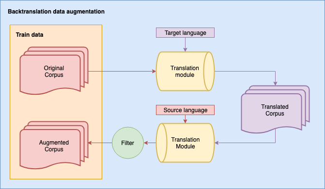
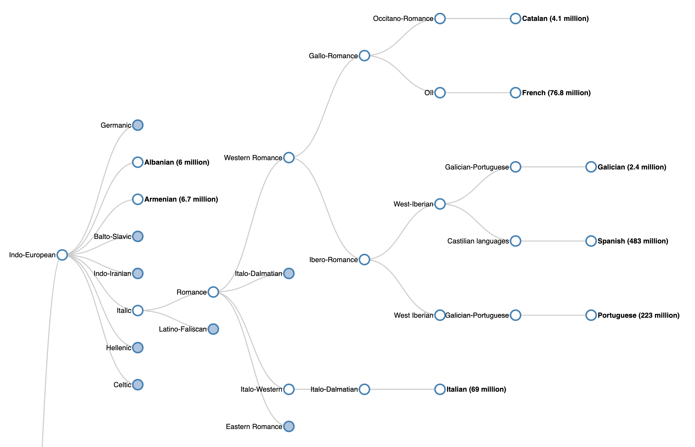

 

# BET: A Backtranslation Approach for Easy Data Augmentation in Transformer-based Paraphrase Identification Context

We bet on it and it worked. This repository includes the scripts to train transformers (_finetuneutils.py_ and _torchutils.py_) from Huggingface library with Pytorch.
We load the data from module _datautils.py_. We prepared the _main.py_ script to run the training and evaluation.
Finally, we use the _run_loop.py_ to run iteratively all the configuration for BET experiment:
datasets, transformers and different augmentation languages.

# Clustering Languages 

We clustered all the Google Translation languages into the related language families based on the information provided in the Wikipedia info-boxes. The Romance branch is illustrated in the following figure.

 

## Install dependencies

    pip install -r requirements.txt

## Disclaimer

Some parts of the code were inspired by HuggingFace Transformers Implementations.
