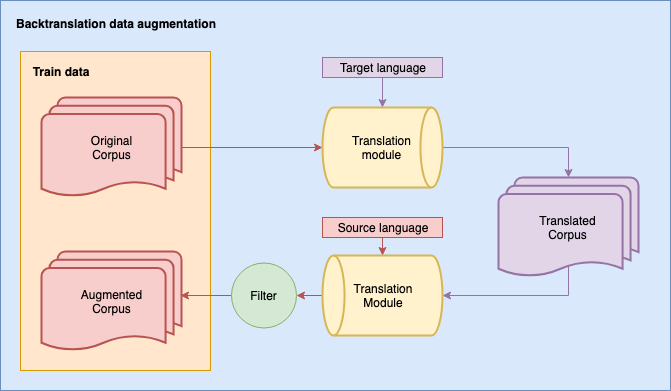

# _Google Translate_ Backtranslation for NLP data augmentation

By Jean-Philippe Corbeil and Hadi Abdi Ghadivel

This script was programmed for data augmentation of NLP copora for the paraphrase identification task. It can easily be adapted for any other NLP task. We use Google API. Thus, you need to provide your own Google API token in your own _.env_ file and activate Google Translate API.

  
_Figure 1._ Data augmentation in NLP with backtranslation procedure.

No filter is applied in this part of the code. We leave it to further processing steps.

## Install depencies

Simply use the _requirements.txt_ file (better in virtual environment):

    pip install -r requirements.txt

##

*Last update*: June 8th, 2020.
